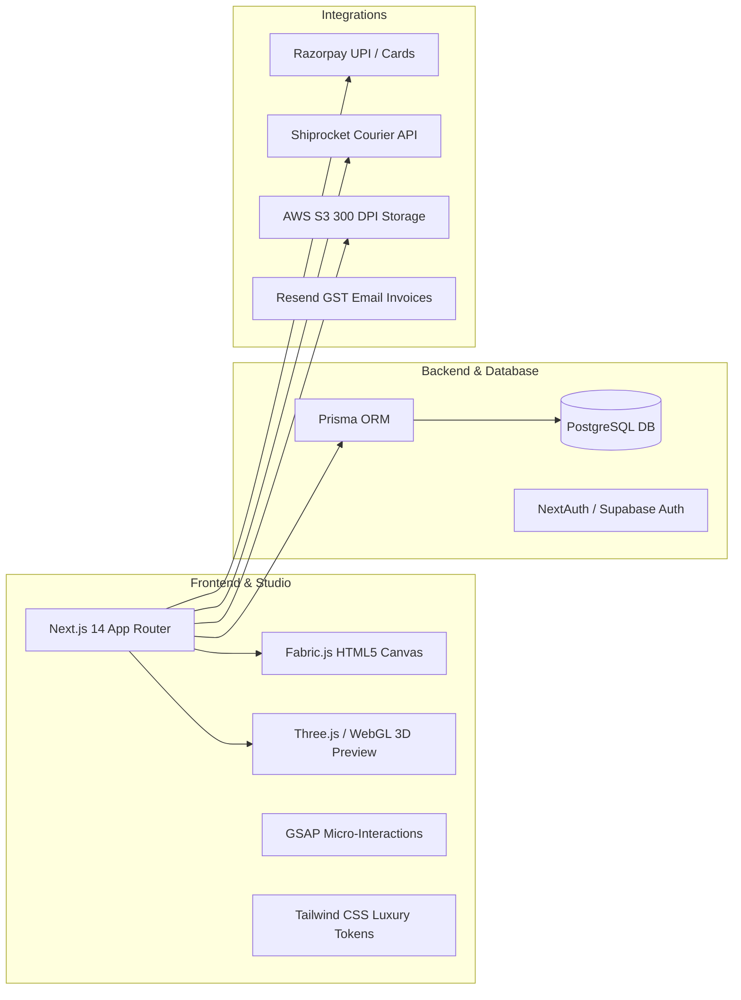

# 👑 Incredible Treasures | Luxury Web-to-Print Platform
> Production-ready, 30-Day Web-to-Print & Luxury Corporate Gifting E-Commerce Platform built for **M/s Incredible Treasures (Bangalore, India)**.


---

## 💎 About The Brand

**Incredible Treasures** is a Bangalore-based premier corporate gifting, luxury personalized merchandise, and high-end print-on-demand enterprise.

- **Entity:** M/s Incredible Treasures (Partnership)
- **Headquarters:** Yelahanka, Bengaluru, Karnataka – 560064
- **Official Credentials:** GSTIN: `29AAKFI2392F1Z5` | UDYAM: `UDYAM-KR-03-0309999`
- **Brand Colors:** Luxury Gold (`#D4AF37`), Obsidian Black (`#0A0A0A`), Pearl White (`#FFFFFF`)

---

## 🌟 Why This Beats Vistaprint (10x Better UI/UX)

1. **Anti-AI-Slop Luxury Aesthetic ([Taste Skill](https://www.tasteskill.dev/)):** No generic bootstrap layouts. Editorial high-contrast typography, layered dark surfaces, and rich champagne gold accents.
2. **Interactive WebGL 3D Card Studio ([ThreeUI](https://threeui.com/)):** Real-time 3D card tilt with realistic lighting reflections showing the true difference between **Matte** and **Glossy** finishes.
3. **60 FPS Micro-Interactions ([GSAP](https://gsap.com/)):** Magnetic buttons, live number tickers for dynamic quantity pricing, and fluid canvas controls.
4. **Curated Component Engineering ([21st.dev](https://21st.dev/)):** Sleek Bento Grids, floating studio docks, and friction-free 2-step Indian UPI checkout.
5. **Real-Time DPI Quality Meter:** Proactive canvas alert that informs customers if their uploaded logo is 300+ DPI (Crisp) or <150 DPI (Blurry) before they place the order.
6. **1-Click Factory Print Hub:** Automated high-resolution **300 DPI vector PDF** generation ready for industrial printing presses.

---

## 📚 Complete Project Documentation

All specifications, daily roadmaps, client checklists, and security designs are stored in [`/docs`](docs/):

| Document | Description |
| :--- | :--- |
| 📖 [**Master 30-Day Roadmap**](docs/MASTER_30_DAY_ROADMAP.md) | Day-by-day unified roadmap covering Code, Automated QA, and Client responsibilities. |
| 📅 [**Day-by-Day Execution Plan**](docs/DAY_BY_DAY_EXECUTION_PLAN.md) | Granular daily objectives, code tasks, and end-of-day client deliverables. |
| 🛡️ [**Client Requirements & Security Blueprint**](docs/CLIENT_REQUIREMENTS_&_SECURITY.md) | Bank-grade security matrix (HMAC signatures, rate limiting, presigned S3 uploads, GST). |
| 📋 [**Client Deliverables Guide**](docs/CLIENT_DELIVERABLES_GUIDE.md) | What the Bangalore client must provide and test week-by-week. |
| 🎨 [**Design System & Aesthetics**](docs/DESIGN_SYSTEM_&_AESTHETICS.md) | Tokens, typography, and implementation guide for Taste Skill, ThreeUI, GSAP & 21st.dev. |
| 🧪 [**Testing & Paid Infrastructure Guide**](docs/TESTING_QA_&_INFRASTRUCTURE.md) | Autonomous Browser Subagent testing pipeline and client infrastructure cost breakdown. |
| 📊 [**Vistaprint Comparative Analysis**](docs/VISTAPRINT_ANALYSIS.md) | Technical architecture comparison and competitive advantage. |

---

## 🛠️ Production Tech Stack



---

## 🗓️ 30-Day High-Level Milestones

- **Week 1 (Days 1–7):** Next.js 14 Setup, PostgreSQL Relational Schema, Mega-Menu, PDP & Dynamic Volume Pricing Engine.
- **Week 2 (Days 8–14):** Dual-Sided Web-to-Print Canvas Studio (Fabric.js), QR Generator, Logo Uploader, Real-time DPI Meter, and 3D Mockup Tilt.
- **Week 3 (Days 15–21):** 300 DPI Vector PDF Export Pipeline, Slide-over Cart Drawer, Bangalore Pincode Auto-fill, B2B GSTIN Engine & Razorpay Checkout.
- **Week 4 (Days 22–30):** Admin 1-Click Print Hub, Automated GST Tax Invoices, Shiprocket Logistics, Physical Print Machine Test, ₹1 Live Sanity Test & Go-Live! 🚀

---

## 🚀 Getting Started

```bash
# Clone the repository
git clone https://github.com/priyanshushekhar1319/incredible-treasures.git

# Enter project directory
cd incredible-treasures

# Documentation is located in /docs
```

---
*Maintained by Engineering Team for Incredible Treasures.*
