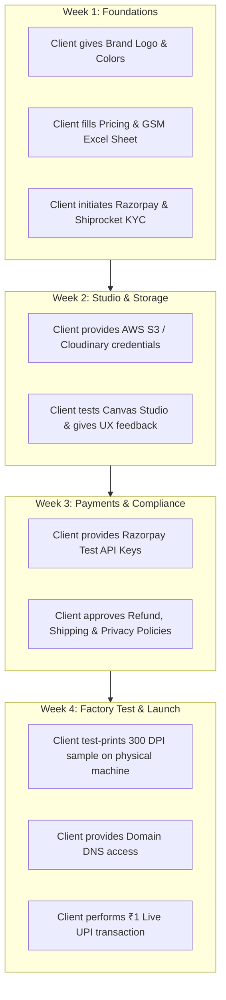

# Client Responsibility & Deliverables Guide
## "Client Se Kya Kya Chahiye Aur Unka Kaam Kya Hai"

---

## 📌 Summary: Client Ka Role & Deliverables (At a Glance)

---

## 🗓️ Week-by-Week: Client Ko Kab Kya Dena Hai Aur Unka Kaam Kya Hai

### 🔵 WEEK 1 (Days 1–7): Data, Branding & Account Initiation

#### 1. What Client Needs to Give:
- **Brand Assets:**
  - Company Brand Name & Logo (.SVG or high-res .PNG).
  - Primary & Secondary brand colors (Hex codes).
  - Favicon (or square logo).
- **Product Catalog & Pricing Sheet (Excel / Google Sheet):**
  - Products to launch initially (e.g. Visiting Cards, Letterheads, Envelopes, T-Shirts, Stamps).
  - Paper Stock specs (e.g., 300 GSM Standard, 350 GSM Premium, 400 GSM Matte).
  - Finishes (Matte, Glossy, Velvet touch, Spot UV, Rounded corners).
  - Quantity Pricing Slabs: Exact rates for 100 pcs, 250 pcs, 500 pcs, 1000 pcs, 2500 pcs.
- **Company Legal Information:**
  - Registered Business Name, Bangalore office address, Contact phone, Support email.
  - **GSTIN Number** (Essential for B2B invoice generation).

#### 2. Client Ka Kaam Kya Hai (Immediate Actions):
- **Action 1 (Day 1):** Start **Razorpay Merchant KYC** immediately! (Payment gateways take 2–4 business days to approve business accounts, so starting on Day 1 is critical).
- **Action 2 (Day 2):** Create a **Shiprocket** account and set up the pickup warehouse address in Bangalore.
- **Action 3 (Day 4):** Finalize and sign-off on the Pricing Excel Sheet.

---

### 🎨 WEEK 2 (Days 8–14): Studio Feedback & Cloud Storage

#### 1. What Client Needs to Give:
- **Cloud Storage Account:**
  - AWS S3 Bucket credentials (`Access Key`, `Secret Key`, `Bucket Name`) OR Cloudinary account. (Needed to store customer's 50MB print files).
- **Raw Template Designs (Optional but recommended):**
  - If the client's graphic designer has existing Photoshop/Illustrator files for Doctor/Lawyer/Corporate visiting cards, provide them so we can convert them into interactive templates.

#### 2. Client Ka Kaam Kya Hai:
- **Action 1 (Day 14):** **Canvas Studio User Review:**
  - Client will open the preview link on both phone and laptop.
  - Test dragging text, uploading a logo, changing colors, checking the 3D card preview.
  - Give final UX sign-off on the design editor.

---

### 💳 WEEK 3 (Days 15–21): Payment Setup & Legal Approvals

#### 1. What Client Needs to Give:
- **Razorpay API Keys (Test Mode):**
  - `Key_Id` & `Key_Secret` from Razorpay Dashboard -> Settings -> API Keys.
- **Support & Grievance Contact:**
  - Customer care email (e.g., `support@brandname.in`) and phone number for the website footer.

#### 2. Client Ka Kaam Kya Hai:
- **Action 1 (Day 18):** Review & approve the standard legal policy drafts:
  - Return & Refund Policy (Rules on custom-printed goods).
  - Shipping & Delivery SLA Policy (e.g., 2–3 days within Bangalore, 5–7 days Pan-India).
  - Terms of Service & Privacy Policy.
- **Action 2 (Day 20):** Confirm tax breakdown (Intra-state 9% CGST + 9% SGST vs Inter-state 18% IGST).

---

### 🏭 WEEK 4 (Days 22–30): Physical Print Test, Domain & Go-Live

#### 1. What Client Needs to Give:
- **Domain Access:**
  - Access to GoDaddy / Namecheap / Hostinger / Cloudflare to configure DNS records (`A` record, `CNAME`, SSL).
- **Shiprocket Production API Token:**
  - Shiprocket Dashboard -> Settings -> API -> Generate Token.
- **Razorpay LIVE Production Keys:**
  - Client switches toggle from "Test Mode" to "Live Mode" and generates live API credentials.

#### 2. Client Ka Kaam Kya Hai (The Critical Final Checks):
- **Action 1 (Day 23) - Physical Machine Print Test:**
  - Admin panel se hum ek test order ka 300 DPI Print Package download karenge.
  - **Client ka kaam:** Is PDF file ko apni factory/printing press ki machine par physically print nikal kar check kare ki color, alignment aur cut border 100% perfect hai ya nahi.
- **Action 2 (Day 25):** Recharge ₹500–₹1,000 in Shiprocket wallet for shipping label generation.
- **Action 3 (Day 29) - Live ₹1 Sanity Test:**
  - Client apne khud ke phone se website par ₹1 ka real UPI test payment karega.
  - Check karega ki ₹1 unke bank account me settlement ke liye show ho raha hai aur order receipt unke email par aa rahi hai.
- **Action 4 (Day 30):** Final Acceptance & Sign-off! 🚀
