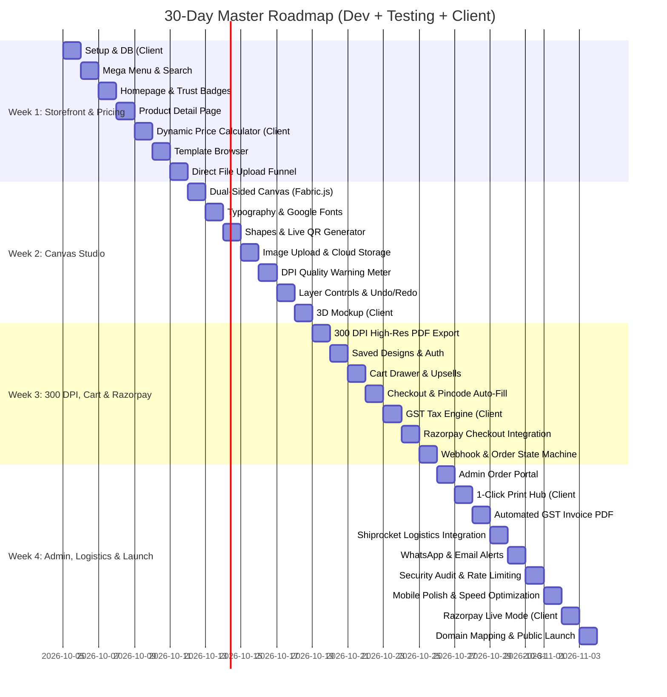

# Master 30-Day Production Roadmap
## Unified Execution Matrix: Development, Testing & Client Deliverables

Every single day is structured into three concrete tracks:
1. 🛠️ **Hamara Kaam (Build & Code):** What Antigravity writes & integrates.
2. 🧪 **Antigravity Testing (100% Working Check):** How we automatically test and prove functionality.
3. 👤 **Client Ka Kaam / Requirement:** What the client must provide, decide, or test on that day.

---

---

## 📅 WEEK 1: Storefront, Database & Pricing Engine

### **Day 1: Project Setup & Relational Data Architecture**
* 🛠️ **Hamara Kaam:** Initialize Next.js 14+ (App Router, TypeScript, Tailwind). Set up Supabase PostgreSQL with Prisma ORM models (`User`, `Category`, `Product`, `ProductVariant`, `VolumeTier`, `Order`).
* 🧪 **Testing:** Execute automated database migration and seed script. Verify successful connection ping.
* 👤 **Client Ka Kaam:** 
  1. Share Brand Logo (.SVG / high-res .PNG) & official brand colors.
  2. Share Legal business name, Bangalore address & GSTIN.
  3. **Initiate Razorpay Merchant KYC** on `razorpay.com`.

### **Day 2: Vistaprint-Style Global Navigation & Mega Menu**
* 🛠️ **Hamara Kaam:** Build responsive header with multi-level Mega Menu (Visiting Cards, Stationery, Apparel) + global instant search bar + mobile drawer.
* 🧪 **Testing:** Antigravity Browser Subagent clicks through categories, verifies hover cards and mobile slide drawer.
* 👤 **Client Ka Kaam:** Download and review the Pricing & Paper Specification template (Excel).

### **Day 3: Premium Homepage UI**
* 🛠️ **Hamara Kaam:** Promotional Hero Banner with dynamic CTAs, Top Categories visual grid, Customer reviews carousel, "100% Quality Guaranteed" trust badges.
* 🧪 **Testing:** Page load speed test (<800ms) with zero layout shift (CLS < 0.1).
* 👤 **Client Ka Kaam:** Approve homepage visual tone and banners.

### **Day 4: Product Detail Page (PDP) Layout**
* 🛠️ **Hamara Kaam:** Multi-image gallery with zoom-on-hover, paper specification accordion tabs, reviews & FAQ section, Dual CTA ("Upload Design" vs "Customize Online").
* 🧪 **Testing:** Mobile & desktop zoom smoothness; verify responsive touch swipes.
* 👤 **Client Ka Kaam:** Submit the completed Pricing & Quantity Tier Excel sheet (rates for 100, 500, 1000 pcs).

### **Day 5: Dynamic Volume Pricing Engine**
* 🛠️ **Hamara Kaam:** Real-time client & server price calculator (Paper Stock: 300 vs 350 GSM, Finish: Matte vs Gloss vs Spot UV, Quantity: 100/500/1000 pcs discount math).
* 🧪 **Testing:** Vitest automated math tests for formulas; Browser Subagent clicks through options and asserts price updates.
* 👤 **Client Ka Kaam:** Verify calculated prices against their actual print shop profit margins.

### **Day 6: Design Template Browser**
* 🛠️ **Hamara Kaam:** Industry filter bar (Doctors, IT, Lawyers, Real Estate), interactive card preview cards with front/back hover flip.
* 🧪 **Testing:** Browser Subagent filters by industry and clicks "Customize" to route to editor.
* 👤 **Client Ka Kaam:** (Optional) Share existing raw templates/designs from their graphic designer.

### **Day 7: Direct File Upload Workflow**
* 🛠️ **Hamara Kaam:** Drag-and-drop file uploader (PDF, AI, PSD, PNG), client-side file size (<50MB) and format validator, artwork safety checklist modal.
* 🧪 **Testing:** Upload 40MB PDF test file, verify valid file accepted and invalid `.exe` file blocked.
* 👤 **Client Ka Kaam:** Create Shiprocket logistics account and set Bangalore warehouse pickup pincode.

---

## 🎨 WEEK 2: The Heart — Online Web-to-Print Design Studio

### **Day 8: Dual-Sided Canvas Engine (Fabric.js)**
* 🛠️ **Hamara Kaam:** Fabric.js HTML5 Canvas with real print dimensions (3.5" x 2.0"), Bleed Line, Trim Line, Safe Zone print margins, Front & Back side tab switcher.
* 🧪 **Testing:** Switch between front & back 20 times; assert objects don't lose position or state.
* 👤 **Client Ka Kaam:** Status check on Razorpay KYC approval.

### **Day 9: Typography & Text Engine**
* 🛠️ **Hamara Kaam:** Text tools (Heading/Body), Google Fonts loader (Poppins, Montserrat, Inter, Roboto), Color picker, Font size slider, Alignment, Letter spacing.
* 🧪 **Testing:** Browser subagent types sample doctor card text, changes font & color, asserts text updates.
* 👤 **Client Ka Kaam:** Confirm font preferences or regional language requirements (Kannada / Hindi).

### **Day 10: Shape Library & Live QR Code Generator**
* 🛠️ **Hamara Kaam:** Vector shapes (Lines, Rectangles, Badges, Dividers), Dynamic QR Code generator (UPI ID / Website / vCard QR placed directly on canvas).
* 🧪 **Testing:** Phone camera scan test on generated QR code to verify it resolves to the real link/UPI.
* 👤 **Client Ka Kaam:** None (Development day).

### **Day 11: Logo & Image Uploader**
* 🛠️ **Hamara Kaam:** Customer image upload tool, canvas manipulation (Drag, Scale, Rotate, Crop, Flip, Snap-to-center guides).
* 🧪 **Testing:** Upload transparent PNG logo; verify boundary snapping and smooth rotation.
* 👤 **Client Ka Kaam:** Provide AWS S3 / Cloudinary credentials for high-res file hosting.

### **Day 12: Real-time DPI Quality Meter**
* 🛠️ **Hamara Kaam:** Image resolution analyzer calculating uploaded image DPI relative to canvas size. Live badge (🟢 300+ DPI Crisp vs 🔴 Blurry Warning).
* 🧪 **Testing:** Upload 72 DPI image (assert Red warning appears); upload 300 DPI image (assert Green badge appears).
* 👤 **Client Ka Kaam:** None (Development day).

### **Day 13: Layer Management & History Engine**
* 🛠️ **Hamara Kaam:** Layer controls (Bring to front/back), Delete, Duplicate, Undo/Redo history stack (`Ctrl+Z`, `Ctrl+Y`).
* 🧪 **Testing:** 15 consecutive undo/redo actions; verify canvas state integrity.
* 👤 **Client Ka Kaam:** None (Development day).

### **Day 14: Interactive 3D Mockup Preview & Studio Sign-off**
* 🛠️ **Hamara Kaam:** 3D Card Preview modal with interactive tilt/rotate physics, realistic matte texture & glossy light sheen reflections.
* 🧪 **Testing:** 60 FPS animation performance check on mobile & desktop browsers.
* 👤 **Client Ka Kaam:** **Milestone Review 1:** Client tests the Studio on laptop and mobile, customizes a card, and signs off on UX.

---

## 💳 WEEK 3: 300 DPI Export, Cart, GST & Payments

### **Day 15: 300 DPI High-Resolution Export Engine**
* 🛠️ **Hamara Kaam:** Server-side / headless canvas rendering pipeline to generate 300 DPI print-ready vector PDF and high-res PNG.
* 🧪 **Testing:** Automated PDF metadata script checking DPI = 300, dimensions = 3.75" x 2.25" (with bleed), text vector sharpness.
* 👤 **Client Ka Kaam:** None (Pipeline day).

### **Day 16: Saved Designs & Customer Account Portal**
* 🛠️ **Hamara Kaam:** Serialize canvas to JSON in DB, "My Saved Designs" gallery, 1-click re-order flow, customer auth (Google / Phone OTP).
* 🧪 **Testing:** Save design as User A, login as User B (verify User B cannot see User A's design - RLS check).
* 👤 **Client Ka Kaam:** Provide Support Email (e.g. `support@clientbrand.in`) and Customer Care phone number.

### **Day 17: Slide-over Cart Drawer & Upsells**
* 🛠️ **Hamara Kaam:** Persistent Cart drawer with front/back custom thumbnails, card holder & envelope upsells, coupon discount engine.
* 🧪 **Testing:** Add items, apply promo code `LAUNCH10` (verify 10% deducted accurately), test upsell add/remove.
* 👤 **Client Ka Kaam:** Approve standard policy drafts (Return, Refund, Shipping SLA, Privacy Policy).

### **Day 18: Indian Checkout Page & Pincode Auto-Lookup**
* 🛠️ **Hamara Kaam:** Streamlined checkout with Indian Pincode auto-lookup (pincode input triggers City, State, District auto-fill).
* 🧪 **Testing:** Test pincodes (`560001` Bangalore, `110001` Delhi, `400001` Mumbai); verify instant auto-fill.
* 👤 **Client Ka Kaam:** Provide Razorpay Test API Keys (`Key_Id` & `Key_Secret`).

### **Day 19: B2B GST Calculation Module**
* 🛠️ **Hamara Kaam:** Company GSTIN input & regex validator; Automated tax calculation (Karnataka: 9% CGST + 9% SGST; Outside: 18% IGST).
* 🧪 **Testing:** Unit tests for tax rounding to exact 2 decimal places with various cart totals.
* 👤 **Client Ka Kaam:** Confirm company GSTIN and tax classification.

### **Day 20: Razorpay Payment Gateway Integration**
* 🛠️ **Hamara Kaam:** Razorpay Standard Checkout SDK integration on checkout; Server-side order creation API.
* 🧪 **Testing:** Razorpay Sandbox UPI QR scan test payment; verify checkout popup completes.
* 👤 **Client Ka Kaam:** Test a sample transaction in Sandbox mode from their side.

### **Day 21: Razorpay Webhook & Order Engine**
* 🛠️ **Hamara Kaam:** Cryptographic HMAC-SHA256 signature verification on webhook; Idempotent order processing; Order confirmation success screen.
* 🧪 **Testing:** Trigger fake/spoofed webhook (assert rejected 400); Trigger valid webhook (assert order marked `PAID`).
* 👤 **Client Ka Kaam:** Review customer order confirmation receipt email template.

---

## 🏭 WEEK 4: Admin Operations, Logistics, Security & Go-Live

### **Day 22: Admin Order Management Portal**
* 🛠️ **Hamara Kaam:** Role-protected `/admin/orders` dashboard with live status pipeline (New -> Prepress -> Printing -> Shipped).
* 🧪 **Testing:** Role-based access test (assert ordinary customer redirected with 403 Forbidden).
* 👤 **Client Ka Kaam:** Provide staff names/emails who will manage orders.

### **Day 23: 1-Click Print Production Hub & Physical Print Test**
* 🛠️ **Hamara Kaam:** Admin **"Download Print Package (ZIP)"** button bundling Front 300 DPI PDF + Back 300 DPI PDF + Factory Job Sheet.
* 🧪 **Testing:** Download ZIP, extract, and inspect production files.
* 👤 **Client Ka Kaam:** **Critical Action:** Client downloads the test PDF and runs a physical test print on their factory printing machine to verify colors & cutting edges.

### **Day 24: Automated GST Tax Invoice PDF Generator**
* 🛠️ **Hamara Kaam:** Server-side PDF tax invoice generator with Govt compliant B2B invoice layout, client GSTIN, HSN codes, and digital stamp.
* 🧪 **Testing:** Generate invoice for B2C and B2B orders; verify tax invoice PDF formatting.
* 👤 **Client Ka Kaam:** Review and approve invoice layout.

### **Day 25: Logistics Automation (Shiprocket API)**
* 🛠️ **Hamara Kaam:** Shiprocket API integration for 1-click AWB generation, courier assignment (Delhivery/Bluedart), shipping label barcode printing.
* 🧪 **Testing:** Generate sample test shipping label with barcode.
* 👤 **Client Ka Kaam:** Provide Shiprocket API token & recharge ₹500–₹1,000 wallet balance.

### **Day 26: WhatsApp & Email Transactional Alerts**
* 🛠️ **Hamara Kaam:** Automated email dispatch (Resend API) with invoice PDF attached + WhatsApp tracking link dispatch (Interakt/Wati).
* 🧪 **Testing:** Place test order; verify email arrives in inbox (not spam) and WhatsApp ping arrives on phone.
* 👤 **Client Ka Kaam:** Verify WhatsApp message format & text.

### **Day 27: Bank-Grade Security Audit & Rate Limiting**
* 🛠️ **Hamara Kaam:** Upstash Redis rate limiting on OTP, login, and checkout endpoints; SQL injection & XSS sanitization audit; CSP headers.
* 🧪 **Testing:** Automated penetration test script (flood 50 requests in 5 seconds -> assert 429 Too Many Requests).
* 👤 **Client Ka Kaam:** Provide Domain Registrar login (GoDaddy/Namecheap/Cloudflare).

### **Day 28: Mobile Responsiveness & Speed Optimization**
* 🛠️ **Hamara Kaam:** Touch gestures optimization on mobile canvas editor; Next.js image optimization (WebP); Bundle size reduction.
* 🧪 **Testing:** Run Google Lighthouse audit; assert 90+ score across Performance, Accessibility, and SEO.
* 👤 **Client Ka Kaam:** Final mobile UX walkthrough on their personal phone.

### **Day 29: Razorpay Live Mode Switch & ₹1 Live Transaction**
* 🛠️ **Hamara Kaam:** Update environment variables with Razorpay LIVE Production Keys; verify webhook endpoint on production domain.
* 🧪 **Testing:** Execute ₹1 live UPI transaction.
* 👤 **Client Ka Kaam:** **Critical Action:** Client scans UPI QR with real GPay/PhonePe, pays ₹1, and verifies money settlement in their bank account.

### **Day 30: Production DNS Mapping & Public Launch! 🚀**
* 🛠️ **Hamara Kaam:** Cloudflare SSL configuration, DNS A & CNAME mapping, production database backup snapshot.
* 🧪 **Testing:** Complete end-to-end smoke test on public live domain (`https://clientbrand.in`).
* 👤 **Client Ka Kaam:** Final acceptance, Super Admin credentials handover, and celebratory launch! 🎉
