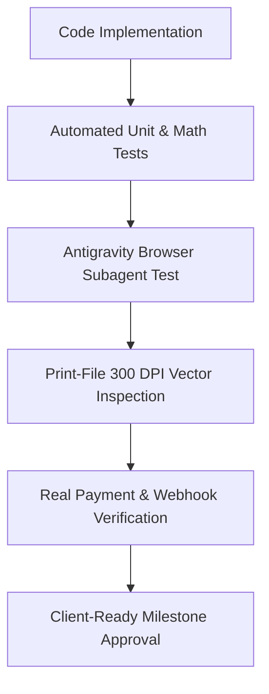

# 100% Working Verification & Paid Infrastructure Plan

This document details how we will rigorously test and verify every module of the platform using Antigravity's autonomous tools, along with the paid production infrastructure stack.

---

## 🧪 1. How Antigravity Will Continuously Test & Prove 100% Working

We will not write code blindly. Every module will be strictly verified using a 4-tier testing pipeline:

### Tier 1: Antigravity Autonomous Browser Subagent Verification
- **What it does:** Antigravity launches its built-in browser agent to test user flows like a real human.
- **What we test autonomously:**
  1. Opens `localhost:3000`, navigates the Mega-Menu, and clicks on *Visiting Cards*.
  2. Selects 350 GSM + Glossy + 500 Quantity — verifies price updates dynamically on the screen.
  3. Enters the **Canvas Studio**:
     - Clicks "Add Text", types "Dr. Rajesh Sharma, MD".
     - Selects font "Montserrat", changes color to Navy Blue.
     - Uploads sample logo and tests drag, drop, rotate, and scale.
     - Verifies the **DPI Quality Indicator** turns Green (300 DPI) or Red (<150 DPI).
     - Flips to **Back Side** and tests dual-sided layout.
     - Opens **3D Mockup Preview** and confirms card rotates cleanly.
  4. Adds item to cart, proceeds to checkout, enters Bangalore pincode `560001`, and verifies city/state auto-fill.
  5. Captures screen recordings and screenshots as proof of completion.

### Tier 2: Mathematical & Business Logic Tests (Vitest / Jest)
- **Zero-Tolerance Calculations:**
  - **Dynamic Price Formula**: `BasePrice + (PaperGSM_Modifier) + (Finish_Modifier) * QuantityDiscountSlab`.
  - **GST Invoicing Math**:
    - Intra-Karnataka: Exact 9% CGST + 9% SGST rounding.
    - Inter-State: Exact 18% IGST calculation.
  - **Coupon Engine**: Percentage vs flat discounts, minimum order value checks, expiry date validation.

### Tier 3: Print-Ready 300 DPI PDF Quality Check
- **Physical Print Inspection**:
  - We run automated scripts to inspect the generated PDF metadata.
  - Verifies resolution is strictly **300 DPI** (dots per inch) and physical dimensions match (e.g. 3.5" x 2.0" + 0.125" bleed).
  - Ensures vector text does not get rasterized/pixelated.

### Tier 4: Razorpay Sandbox & Webhook Verification
- Automated webhook simulation script testing:
  - `payment.authorized`
  - `payment.captured`
  - `payment.failed`
  - Verifies that database updates order status from `PENDING` to `PAID` within 500ms without double charging.

---

## 💳 2. Paid Infrastructure Setup (Client Budget Guide)

Since the client is funding the database, domain, and infrastructure, we will use industry-standard enterprise services:

| Component | Recommended Paid Service | Estimated Monthly Cost | Why This is Best |
| :--- | :--- | :--- | :--- |
| **Domain & DNS** | Cloudflare / GoDaddy | ~₹800 – ₹1,200 / year | Enterprise DDoS protection, global edge caching, free SSL. |
| **Hosting & Edge CI/CD** | Vercel Pro | ~$20 / month (~₹1,700) | Zero-downtime deploys, Next.js native optimization, edge functions. |
| **Managed Database** | Supabase Pro (PostgreSQL) | ~$25 / month (~₹2,100) | Daily automated backups, Point-in-time recovery, 8GB database, Row-Level Security. |
| **High-Res File Storage** | AWS S3 + CloudFront CDN | ~₹500 – ₹1,000 / month | Unlimited storage for heavy 300 DPI customer print files. |
| **Payment Gateway** | Razorpay / Cashfree | 0 setup fee (Standard 2% transaction fee) | UPI, Netbanking, Cards, instant settlements. |
| **Logistics** | Shiprocket | Prepaid wallet (recharge as needed) | Automated courier assignment (Delhivery/Bluedart) & tracking. |
| **Transactional Email** | Resend / SendGrid | Free tier -> $20/mo | 99.9% inbox delivery for GST invoices and order receipts. |
| **WhatsApp Business** | Interakt / Wati | ~₹1,500 – ₹2,500 / month | Automated WhatsApp tracking links with green tick capability. |

---

## 🔄 3. Continuous Testing Workflow per Milestone

Every time we complete a sprint:
1. **Code Compilation & Lint Check**: Zero TypeScript errors.
2. **Automated Subagent Browser Walkthrough**: Antigravity opens the live page and verifies user journey.
3. **Report Generation**: We show you the exact working test result before moving to the next day.
