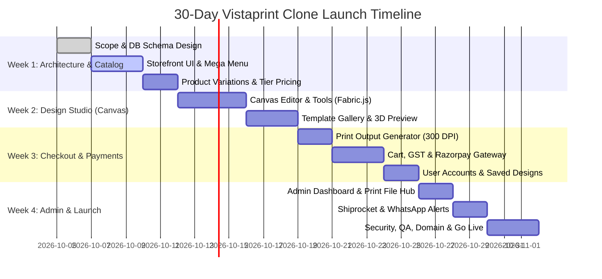

# 30-Day Launch Roadmap: Vistaprint-Like Web-to-Print E-Commerce Platform

This roadmap provides a production-grade, day-by-day plan to build and launch a fully functional custom printing e-commerce platform (similar to Vistaprint India) within 30 days using **Antigravity**.

---

## 🛠 Recommended Production Tech Stack

| Component | Technology | Rationale |
| :--- | :--- | :--- |
| **Frontend & Backend** | **Next.js 14/15 (App Router, TypeScript)** | High performance, built-in SEO for product pages, API routes, fast SSR. |
| **Database & Auth** | **Supabase (PostgreSQL) + Prisma ORM** | Instant auth, row-level security, relational data for complex variants/orders. |
| **Design Studio Engine** | **Fabric.js or Konva.js** | Industry standard HTML5 canvas library for drag-and-drop, text, layers, print export. |
| **Asset Storage** | **Cloudinary or AWS S3** | High-res print file storage (300 DPI vectors/PNGs/PDFs) and fast CDN delivery. |
| **Payment Gateway** | **Razorpay / Cashfree** | UPI, Netbanking, Cards, EMI, Wallets with native Indian checkout & Webhook verification. |
| **Invoicing & GST** | **Puppeteer / React-PDF** | Automated GST compliant B2B/B2C tax invoice generation with GSTIN. |
| **Logistics / Courier** | **Shiprocket API** | Pincode serviceability, automated AWB generation, live tracking. |
| **Notifications** | **Resend (Email) + Interakt / Gupshup (WhatsApp)** | Automated order confirmation, dispatch updates, invoice PDFs. |
| **Hosting & CI/CD** | **Vercel + Supabase Cloud + Cloudflare** | Zero-downtime deployments, global edge CDN, automatic SSL. |

---

## 📅 Day-by-Day 30-Day Execution Schedule

---

### Phase 1: Foundation, DB Architecture & Storefront (Days 1–7)

#### Day 1: Project Setup & Data Modeling
- Initialize Next.js 14+ project with TypeScript and modern Tailwind styling.
- Design database schema in Supabase/PostgreSQL:
  - `Categories` (Business Cards, Stationery, Apparel, Marketing, Gifting).
  - `Products` & `ProductVariants` (Paper stock: 350 GSM, Matte/Gloss, Corners: Rounded/Square).
  - `VolumeTiers` (Tiered pricing e.g. 100 pcs = ₹350, 500 pcs = ₹1,200, 1000 pcs = ₹1,999).
  - `Templates` (Pre-made designs categorized by profession/industry).
- Setup environment configurations (`.env.example`), Prisma migrations, and seed sample print products.

#### Day 2–3: Vistaprint-Style Storefront & Navigation
- Build high-converting Vistaprint-style Header with:
  - Multi-level Mega Menu (Category dropdowns with thumbnail previews).
  - Search bar with instant typeahead search for products.
  - Cart drawer counter and user auth quick modal.
- Create dynamic Homepage:
  - Hero banner with promotional CTA.
  - Best-seller grid (Visiting Cards, Stamps, Letterheads, T-Shirts, ID Cards).
  - Customer review carousel and "100% Quality Guaranteed" badge section.

#### Day 4–5: Product Detail Page (PDP) & Dynamic Price Calculator
- Implement product view with image gallery / angle preview.
- **Dynamic Configuration Selector**:
  - Paper Stock / Material (Standard, Premium, Recycled).
  - Corner Style (Standard Square, Rounded).
  - Finish (Matte, Glossy, Velvet Touch).
  - Quantity Dropdown with live calculated price per unit and bulk discounts.
- Two Primary CTAs:
  1. *"Upload Your Own Design"* (Direct PDF/AI/PSD/PNG upload).
  2. *"Customize a Template / Design Online"* (Opens online studio).

#### Day 6–7: Design Template Browser
- Template selection grid filtered by Industry (IT, Doctors, Lawyers, Real Estate, Food & Cafe).
- Live template preview modal with front & back preview before entering the editor.

---

### Phase 2: Web-to-Print Online Design Studio (Days 8–15)
> *The custom online canvas editor is the core technology of Vistaprint.*

#### Day 8–10: Canvas Engine (Fabric.js Integration)
- Setup responsive HTML5 Canvas editor (Fabric.js / Konva):
  - Safe Zone, Trim Line, and Bleed Margins guidelines (critical for printing).
  - Dual-sided editor: Tab switcher for **Front Side** and **Back Side**.
  - Text Tool: Add heading/subheading/body text, font family picker (Google Fonts), font size, color palette, line height, letter spacing.
  - Shape Tool: Lines, rectangles, circles, badges, QR Code generator (vCard / UPI / Website).

#### Day 11–12: Image Upload & Layer Management
- Customer image/logo upload with client-side resolution check (warn user if DPI < 300).
- Drag, drop, rotate, scale, flip, and align tools (center horizontally/vertically).
- Layer management: Bring to front, send to back, duplicate, delete.
- Undo / Redo history state stack.

#### Day 13: 3D / Photorealistic Mockup Preview
- Generate realistic mockups on the fly (e.g. rendering business card on a wooden desk, t-shirt preview, mug warp).
- Customer approval checkbox: *"I have verified the spelling and layout. Ready to print."*

#### Day 14–15: Print-Ready Export Pipeline
- Save design as JSON format to database for future re-orders.
- High-Resolution Export Engine:
  - Vector PDF / CMYK conversion pipeline or high-res 300 DPI raster export.
  - Upload raw render assets to secure AWS S3 / Cloudinary bucket.

---

### Phase 3: E-Commerce Funnel, Cart & Payment Gateway (Days 16–21)

#### Day 16–17: Cart & Add-on Upsells
- Cart Drawer & Full Cart page displaying:
  - Thumbnail of custom front & back designs.
  - Selected specs (GSM, Finish, Quantity).
  - Upsell suggestions (e.g., Card holder with Visiting cards, Envelopes with Letterheads).
  - Coupon code redemption engine.

#### Day 18–19: Checkout, GST Invoicing & Address System
- Indian address form with Pincode auto-fill (State & City detection).
- B2B GST Details input (Company Name + GSTIN) with instant validation.
- Automated GST Calculation (CGST + SGST or IGST based on destination state vs origin state).
- Dynamic shipping charge calculation (Free shipping above ₹999).

#### Day 20–21: Razorpay Integration & Order State Engine
- Integrate Razorpay Standard Checkout (UPI, GPay, PhonePe, Cards, NetBanking).
- Server-side cryptographic signature verification on webhook (`payment.captured`).
- Order state machine:
  - `PAYMENT_PENDING` -> `PROCESSING` -> `PREPRESS_CHECK` -> `PRINTING` -> `DISPATCHED` -> `DELIVERED`.

---

### Phase 4: Order Fulfillment, Admin Panel & Operations (Days 22–26)

#### Day 22–24: Admin & Print-Production Dashboard
- Admin dashboard for the printing press / factory:
  - Order list with filtering by status and priority.
  - **One-Click Download Production Package**:
    - High-res print files (Front & Back 300 DPI).
    - Production job sheet (Material, Finish, Quantity, Cut dimensions).
    - GST Tax Invoice PDF.
  - Manual review button: Approve design / Request customer revision.

#### Day 25: Logistics Integration (Shiprocket API)
- Automated AWB generation upon order approval.
- Courier partner assignment (Delhivery, Bluedart, Xpressbees).
- Shipping label printing directly from admin.

#### Day 26: Customer Communication & Tracking
- Automated transactional emails via Resend (Order placed, Artwork approved, Dispatched).
- WhatsApp notification alerts with direct tracking link.
- Customer account portal:
  - Order history with live courier tracking status.
  - "My Saved Designs" library with 1-click reorder.

---

### Phase 5: Testing, Hardening, Polish & Go-Live (Days 27–30)

#### Day 27: Performance, Mobile Responsiveness & Print Quality QA
- Mobile testing: Ensure the design editor is intuitive on mobile touchscreens.
- Stress test print file generation (prevent memory leaks on high-res rendering).
- Core Web Vitals optimization (Lighthouse score 90+).

#### Day 28: SEO & Catalog Content
- Structured Data (Schema.org `Product`, `AggregateRating`, `BreadcrumbList`).
- Metadata & OpenGraph tags for Bangalore local printing searches:
  - *"Custom Visiting Cards in Bangalore", "Corporate Merchandising Bangalore"*.
- Sitemap.xml and robots.txt.

#### Day 29: Production Staging & Gateway Switch
- Switch Razorpay from Test mode to Live mode.
- Execute ₹1 live test transactions for UPI, Card, and Netbanking.
- Test automated refund and cancellation flows.

#### Day 30: Domain Mapping & Public Launch 🚀
- Configure DNS records, SSL, and CDN on Cloudflare / Vercel.
- Smoke test all end-to-end user journeys on production domain.
- Handover admin credentials and production SOP documentation to the client.

---

## ⚡ How to Leverage Antigravity During the 30 Days

1. **Use `/plan` before every phase**:
   - Run `/plan` to generate structured implementation tasks for each milestone before writing code.
2. **Build Modularly**:
   - Let Antigravity generate clean, production-ready schemas, API routes, and components without placeholders.
3. **Use the browser subagent**:
   - Test UI flows, responsiveness, and canvas interactions autonomously in the browser.
4. **Use `/goal` for overnight autonomous progress**:
   - For heavy lifting (e.g. generating the full suite of product seed data or full admin CRUD pages), invoke `/goal`.
